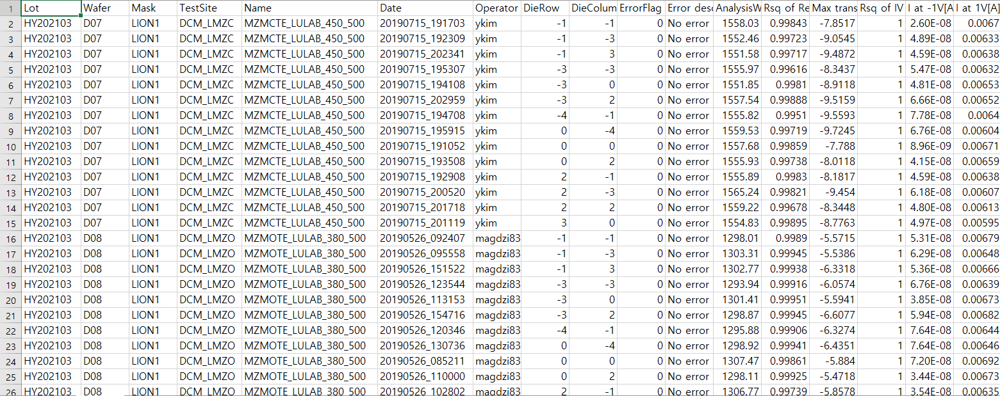
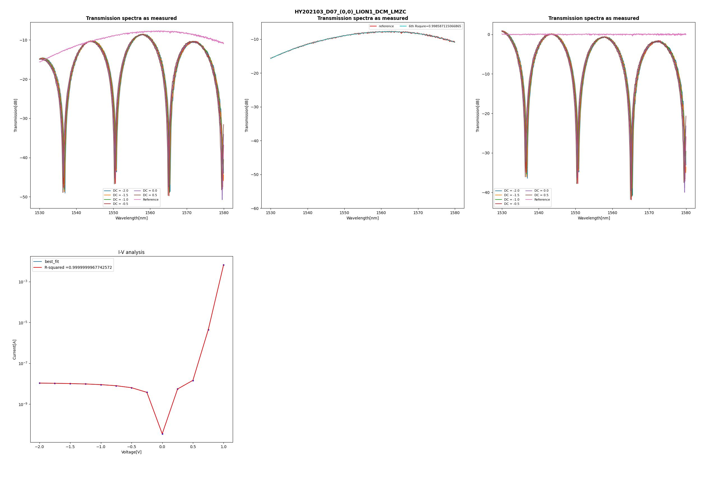

***
## INDEX
1. [Introduction](#1-Introduction)
2. [Install List](#2-Install-list)
3. [Usage](#3-Usage)
4. [Program](#4-Program)
5. [Result](#5-Result)
6. [Contact](#6-Contact)
***
## 1. Introduction
This program is designed to take information from users and analyze it. We created a program 
that extracts and analyzes data provided by customers to show and save information in graphs and csv file for easy understanding.
***
## 2. Install list
Python libraries used by the program include: 

- **etree.ElementTree** : library for implementing simple and efficient APIs for parsing and creating XML data.
- **matplotlib.pyplot** : library for creating a graph using each function of pyplot module. 
- **lmfit** : provides interface to nonlinear optimization and curve fitting problems for Python.
- **glob2** : library for extracting multiple xml files as a list.
- **numpy** : the fundamental package for scientific computing in Python.
- **sklearn** : Python library that you can use to analyze machine learning on Python.
- **dateutil** : The dateutil uses different text formats as date syntax. It is a useful library when dealing with dates by changing them.
- **pandas** : library for primarily using dataframe, and finally to view csv file.
- **os** : allows you to control OS resources such as environmental variables, directories, files, and so on.
- **time** : Used to measure the total running time of a program.
- **warnings** : Use to hide warning messages that appear when using the polyfit() function.
  
**if you want to install all package, enter**
~~~python console
pip install -r requirement.txt
~~~
**in terminal.**
***
## 3. Usage
1. Put the xml file you want to analyze into the 'dat' folder.
2. Enter the desired Lot, Wafer, Row, Column, Maskset, and Testsite on run.py and run it.
~~~python
# example
'''Enter the desired lot'''
lot_id = ['HY202103']

'''Enter the desired wafer'''
wafer_id = ['D08']

'''Enter the desired (row,column)'''
row_column_id = ['(0,0)']

'''Enter the desired Maskset'''
maskset_id = ['LION1']

'''Enter the desired testsite'''
testsite_id = ['LMZ']
~~~
2. Determine whether to save the graph.
3. Determine whether to show the graph.

***
## 4. Program
- **src**
  - **parse.py** : From the xml file in Dat, it collects Voltage and Current and collects L, IL, DC Bias, Reference data in Wavelength Sweep.
  - **plot.py** : It plots the  I-V graph and I-L graph.
From left to right, the first is the Transmission Spectra as measured (raw data), the second is the reference fitting data, the third is raw data - reference fitting data, and the fourth is the I-V fitting graph.
  - **IV.py** : It is a code that fits the IV graph using lmfit and polyfit.
  - **IL.py** : It fits the I-L graph and reference using polyfit and obtain the R-squared coefficient according to the fitting data.
  - **save_csv.py** : It is a code that documents the analyzed data values as a csv file.
  - **savefig.py** : It is a code that allows you to decide whether to save and output a graph.
  - **filename.py**: It brings the name of the file to be analyzed and its root.
  - **final.py**: It is a code that defines the functions to be retrieved and executed in the filename.py.
- **gitignore** : files that do not need to be managed were managed using the gitignore to exclude them from git.
- **run.py** : It is a code that loads Python files of scr folder into one file and executes the project.
- **doc** : It is a jupyter that compare between wafers.
***
## 5. Result
If you run the 'run.py', the resulting folder 'res' is created.
- **csv folder** : csv file  
  
if Rsq of Ref.spectrum <= 0.995, Error description is 'Ref.spec Error' and ErrorFlag is 1.
- **Lots folder** : graph jpg file

  - first graph, transmission spectrum raw graph
  - second graph, reference fitting graph
  - third graph, raw graph - reference fitting
  - fourth graph, I-V raw graph and I-V fitting

***
## 6. Contact
if you have any questions, please contact at the following email.
* 경훈: <qrudgns17@hanyang.ac.kr>
* 선진: <l2020071612@hanyang.ac.kr>
* 민주: <cmj753@hanyang.ac.kr>